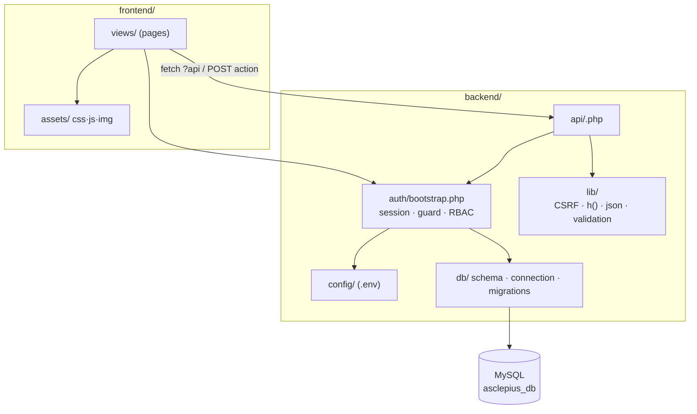

# Architecture

> **Patient portal.** `backend/auth/bootstrap.php` now has a third branch. Before the staff-role
> gate it checks whether the session's role is one of the portal roles, and if so allows the
> request only when `ASCLEPIUS_PORTAL` is defined - which only `backend/auth/portal.php` does.
> That single chokepoint keeps patient accounts out of every staff page and every
> `backend/api/*.php` handler without editing any of them, and (being checked *before* the staff
> branch) avoids a `rbac_deny()` redirect loop back to `Dashboard.php`.
>
> The portal is also architecturally different from the module pages: it is server-rendered with
> plain form POSTs and has **no JSON API**, which keeps the patient-facing data surface down to the
> prepared statements in six files. Authorization is row-scoped (`require_patient()`), not
> module-scoped (`require_module_access()`).

## Current architecture (as-is)

Asclepius is a **server-rendered PHP application** with no framework. Each feature is a single
`*.php` file at the repo root that does three jobs at once:

1. **Backend** — `session_start()`, includes `db.php`, guards the session, and handles its own
   data operations.
2. **API** — the *same file* answers `GET ?api=...` (reads, returns JSON) and
   `POST action=...` (writes, returns JSON).
3. **Frontend** — the rest of the file is the HTML page, with inline `<style>` and a `<script>`
   that calls the file's own `?api=` / POST endpoints via `fetch()`.

```
Browser
  │  GET Patient.php
  ▼
Patient.php ──► session guard ──► render HTML + inline CSS/JS
  │
  │  (page JS) fetch('Patient.php?api=get_patients')  ──► JSON array
  │            fetch POST {action: 'add_patient', ...} ──► {success, message}
  ▼
db.php  ──►  MySQL (asclepius_db)
```

`db.php` is shared by every page. It opens the mysqli connection **and** re-runs all
`CREATE TABLE` statements on every request (DDL-on-every-request). The schema is also defined,
divergently, in `database.sql` and `install.php`.

### Problems this causes

- **No separation of concerns** — HTML, CSS, JS, PHP, and SQL in one 500–1,300 line file per
  module ("spaghetti").
- **Three divergent schema definitions** — `db.php`, `database.sql`, `install.php` disagree.
- **DDL on every request** — every page load attempts to create all tables.
- **Hardcoded, committed credentials** — in `db.php` and `install.php`.
- **No CSRF protection; DB error messages leaked to clients.**

## Target architecture (to-be) — refactor in place

We keep the server-rendered model and the in-page JSON API pattern (it works and the team
knows it), but **separate the concerns** into `frontend/` and `backend/`. No SPA, no
framework, no new runtime dependency.

```
frontend/
  views/                 page markup per module (the entry pages)
  assets/{css,js,img}    shared styles, fetch() logic, images

backend/
  config/   config.php   ← DB credentials from environment (.env, never committed)
  db/       schema.sql    ← single canonical schema; connection; migrations/
  auth/     bootstrap.php ← session + DB + auth guard + RBAC check (included by every page)
  lib/                    ← json_response(), h() escaping, validation, CSRF helpers
  api/      <module>.php  ← per-module JSON handlers (the ?api= GET + POST action logic)
```

### Target request flow

```
Browser ─► frontend/views/Patient page
              │  require backend/auth/bootstrap.php   (session, DB, guard, role check)
              │  render markup + link frontend/assets/css, /js
              ▼
           page JS fetch('backend/api/patients.php?api=get_patients')  ─► JSON
                   fetch POST {action, csrf_token, ...}                 ─► {success,...}
              ▼
           backend/api/patients.php
              │  require bootstrap (auth + RBAC) ─► validate CSRF ─► prepared statement
              ▼
           backend/db (mysqli) ─► MySQL
```

Key differences from today:
- Credentials come from the **environment** (`backend/config`), not source.
- The schema is applied **once** from `backend/db/schema.sql` (migrations), not on every request.
- Auth + RBAC + CSRF are enforced in **shared** code, not copy-pasted per page.
- Markup/assets live in `frontend/`; data logic lives in `backend/`.

### Component diagram (target)



## Folder structure — lessons from a Laravel reference

A Laravel project was shared as a reference. We are **not** adopting Laravel (see the decision
record below), but its layout encodes good conventions worth borrowing into our vanilla setup.
Mapping Laravel → Asclepius:

| Laravel | Purpose | Our equivalent | Adopt? |
|---------|---------|----------------|:------:|
| `app/` | Application code (controllers, models) | `backend/api/` + `backend/db/` + `backend/auth/` + `backend/lib/` | already have |
| `config/` | Configuration | `backend/config/` | already have |
| `database/` (migrations, seeders) | Schema as versioned files | `backend/db/schema.sql` + `backend/db/migrations/` (+ a `seeders/` for demo data) | **yes** — add `migrations/` + `seeders/` |
| `public/` | The **only** web-reachable folder; everything else sits outside the docroot | (today entry pages are at repo root) | **recommended** — see below |
| `resources/` (views, css, js) | Presentation source | `frontend/views/` + `frontend/assets/` | already have |
| `storage/` | Uploaded files, generated files, logs | *(none yet)* | **yes** — add `storage/` for attachments + PDFs |
| `routes/` | URL → handler mapping | file-based (URL = file) | n/a for vanilla PHP |
| `lang/` | Translations (the reference app has FR/EN) | *(none)* | future only (don't build now) |
| `tests/` | Automated tests | *(none yet)* | future (after structure stabilises) |
| `.editorconfig`, `.gitattributes` | Editor/Git hygiene | *(none)* | nice-to-have |

### Worth adopting now

- **`storage/` (outside the web root).** Needed for `medical_records.attachments`, the planned
  **PDF lab results** (FR-16), and X-ray/dental images. Store the file on disk and only a path
  in the DB. Protect it like `backend/` (deny direct web access).
- **`backend/db/migrations/` + `backend/db/seeders/`.** Formalize schema changes as numbered
  files (we already planned migrations) and add seeders for demo/admin data.

### Recommended, but a hosting change

- **A `public/` document root.** Laravel's biggest security win is that only `public/` is
  web-reachable — `app/`, `config/`, `.env` physically cannot be hit over HTTP. We currently
  keep entry pages at the repo root and protect `backend/` with `.htaccess`. Moving entry pages
  into a `public/` folder and pointing the hosting docroot at it is **more secure** (defense in
  depth beyond `.htaccess`), but it changes every page URL and needs docroot control on the host.
  Deferred — revisit if/when we can set the docroot. Tracked in [production-release.md](production-release.md).

### Not now (avoid over-engineering)

- `lang/` (i18n), `routes/` (a router), and a full `tests/` suite are deferred — they add
  structure we don't need yet for a working server-rendered CRUD app.

## Decision record: why no framework (for now)

A framework (Laravel or Slim) was considered and **rejected for this phase**:

- We have **8 working modules**. Adopting a framework is a **multi-week rewrite**
  (controllers + models + Blade views + routes), with real regression risk in code that
  currently works.
- Hosting looks like **shared hosting** (the committed DB user `u805024096_*` matches that
  pattern), where Laravel's Composer/CLI/`public/`-docroot needs are more fragile than the
  current "drop PHP files in place" model.
- The wins people want from a framework — separation of concerns, CSRF, RBAC, migrations,
  prepared statements — are all achievable **in vanilla PHP** via the small helpers above,
  without a rewrite or a heavy dependency. This also matches the project's own engineering
  principles (don't add frameworks without a clear present need; don't rewrite working code).

**Revisit** if the platform grows substantially (many new modules, larger team) and the
hosting/team can support a framework. At that point a Laravel rebuild becomes a deliberate,
budgeted investment rather than incidental risk.

See [backend-plan.md](backend-plan.md) for how we get from as-is to to-be.
