# Database — Entity-Relationship Diagram (Production Target)

This is the **complete production data model**: the 9 tables that exist today, the new staff
**role directories** (Lab Technicians, Cashiers, Receptionists), the planned clinical/diagnostic
modules, and auth/RBAC. Column-level detail is in [database.md](database.md); the build order is
in [migrations.md](migrations.md). Render with any Mermaid viewer (VS Code preview or
<https://mermaid.live>).

Legend: **(now)** = exists today · **(new)** = staff directories to build next ·
**(planned)** = designed, built later.

## Complete target ERD

```mermaid
erDiagram
    users {
        int id PK
        varchar email UK
        varchar password_hash
        varchar full_name
        varchar role "staff: admin|doctor|lab|cashier|reception -- portal: patient_pending|patient|patient_rejected"
        int patientId FK "UK, nullable -- set only for a linked portal account"
        date claimedDob "portal signup: unverified claim, for reception to match"
        varchar claimedPhone "portal signup: unverified claim"
        datetime linkedAt
        int linkedBy FK "which staff account approved the link"
    }
    doctors {
        int id PK
        varchar employeeId UK
        varchar licenseNumber UK
        varchar specialty
        varchar department
        varchar status
    }
    lab_technicians {
        int id PK
        varchar employeeId UK
        varchar section "Hematology|Biochem|Micro"
        varchar shift
        varchar status
    }
    cashiers {
        int id PK
        varchar employeeId UK
        varchar counterNo
        varchar shift
        varchar status
    }
    receptionists {
        int id PK
        varchar employeeId UK
        varchar deskNo
        varchar shift
        varchar status
    }
    patients {
        int id PK
        varchar firstName
        varchar lastName
        date dateOfBirth
        varchar status
    }
    patient_contacts {
        int id PK
        int patientId FK
        varchar contactName
        tinyint isPrimary
    }
    appointments {
        int id PK
        int patientId FK
        int doctorId FK
        int bookedBy FK "planned -> receptionists"
        date appointmentDate
        varchar status
    }
    medical_records {
        int id PK
        int patientId FK
        date recordDate
        varchar diagnosis
    }
    laboratory_results {
        int id PK
        int patientId FK
        int orderedBy FK "-> doctors"
        int performedBy FK "planned -> lab_technicians"
        varchar testType
        varchar abnormalFlag
    }
    prescriptions {
        int id PK
        int patientId FK
        int doctorId FK
        varchar medicationName
        varchar status
    }
    billing {
        int id PK
        int patientId FK
        int appointmentId FK
        int processedBy FK "planned -> cashiers"
        decimal amount
        varchar status
    }
    dental_records {
        int id PK
        int patientId FK
        int dentistId FK "planned -> doctors"
        date recordDate
    }
    psych_sessions {
        int id PK
        int patientId FK
        int doctorId FK
        date sessionDate
    }
    xray_studies {
        int id PK
        int patientId FK
        int orderedBy FK "-> doctors"
        date studyDate
    }
    agency_referrals {
        int id PK
        int patientId FK
        varchar agencyName
        varchar status
    }
    password_resets {
        int id PK
        int userId FK
        varchar token
        datetime expiresAt
    }

    users          ||--o{ password_resets    : "requests"
    users          |o--o| patients           : "portal account for (0..1, UNIQUE)"
    patients       ||--o{ patient_contacts   : "has"
    patients       ||--o{ appointments       : "has"
    doctors        ||--o{ appointments       : "attends"
    receptionists  |o--o{ appointments       : "books (planned)"
    patients       ||--o{ medical_records    : "has"
    patients       ||--o{ prescriptions      : "has"
    doctors        ||--o{ prescriptions      : "writes"
    patients       ||--o{ laboratory_results : "has"
    doctors        |o--o{ laboratory_results : "orders"
    lab_technicians |o--o{ laboratory_results : "performs (planned)"
    patients       ||--o{ billing            : "billed"
    appointments   |o--o{ billing            : "for (SET NULL)"
    cashiers       |o--o{ billing            : "processes (planned)"
    patients       ||--o{ dental_records     : "has (planned)"
    doctors        |o--o{ dental_records     : "treats (planned)"
    patients       ||--o{ psych_sessions     : "has (planned)"
    doctors        |o--o{ psych_sessions     : "conducts (planned)"
    patients       ||--o{ xray_studies       : "has (planned)"
    doctors        |o--o{ xray_studies       : "orders (planned)"
    patients       ||--o{ agency_referrals   : "referred (planned)"
```

## Reading the relationships

- `||--o{` = one-to-many, **mandatory** parent (FK `NOT NULL`, `ON DELETE CASCADE`): deleting
  the patient/doctor deletes the dependent rows.
- `|o--o{` = one-to-many, **optional** parent (FK nullable, `ON DELETE SET NULL`): the link can
  be empty, and deleting the parent nulls it. Used for the "who did it" accountability links
  (`orderedBy`, `performedBy`, `bookedBy`, `processedBy`) and `billing.appointmentId`.

## What's now / new / planned

| Group | Tables | State |
|-------|--------|:-----:|
| Core | users, doctors, patients, patient_contacts, appointments, medical_records, laboratory_results, prescriptions, billing | now |
| **Staff role directories** | **lab_technicians, cashiers, receptionists** | new |
| Accountability columns | `appointments.bookedBy`, `laboratory_results.performedBy`, `billing.processedBy` | planned |
| Auth / RBAC | `users.role`, password_resets | planned |
| Clinical/diagnostic modules | dental_records, psych_sessions, xray_studies, agency_referrals | planned |

## Architect notes (read before building)

1. **Staff modeling — your call, with a tradeoff.** You chose **three separate role pages +
   tables** (lab_technicians / cashiers / receptionists), mirroring the existing `doctors`
   table. That's consistent and simple per-page. The tradeoff: four near-identical staff tables
   with duplicated columns. The cleaner long-term alternative is **one `staff` table with a
   `role` column** feeding three filtered pages (one schema, easy to add roles, simple
   accountability FKs). I've drawn it as **separate tables** per your decision — say the word
   and I'll collapse them into a unified `staff` table instead.

2b. **Portal accounts.** `users |o--o| patients` is the one optional, at-most-one-each-way link in
   the model. A staff row has `patientId NULL`; a linked portal account points at exactly one
   patient, enforced by `UNIQUE(users.patientId)`. `ON DELETE SET NULL` means deleting a patient
   record breaks the link rather than deleting the login, and `require_patient()` then fails closed
   for that account. See [../security.md](../security.md).

2. **Logins vs people.** `users` (login accounts) are separate from the staff directories
   (`doctors`, `lab_technicians`, …). For production, add `users.role` for access control. If you
   later want "this login *is* this staff member," link them — easiest with the unified `staff`
   model (note 1).

3. **Accountability links are optional but valuable.** `performedBy` / `processedBy` /
   `bookedBy` let you report "which tech ran this test / which cashier took this payment / which
   receptionist booked this." All nullable + `ON DELETE SET NULL` so deleting staff never
   destroys clinical/financial history.

4. **File storage.** `medical_records.attachments` and the planned **PDF lab results**
   (FR-16) and X-ray/dental images need a file location — see the `storage/` recommendation in
   [../architecture.md](../architecture.md). Store a path/reference in the row, the bytes on disk
   (outside the web root), never the binary in MySQL.

5. **Referential integrity.** Every child→parent FK has an explicit `ON DELETE` rule
   ([database.md](database.md)). Patient deletion cascades to their clinical records;
   staff deletion nulls accountability links rather than deleting records.
